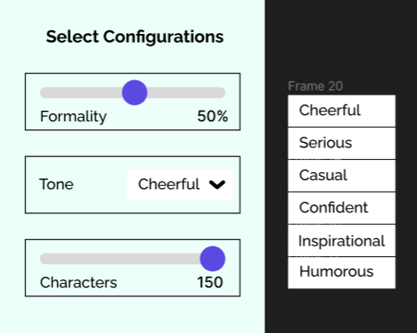
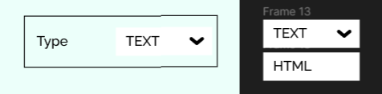

# Hermes
## Deployed URL - Updated
https://hermes-r8fc.vercel.app/

## Introduction
Hermes is an innovative AI-powered messaging platform that enables users to effortlessly generate high-quality text and email content using OpenAI APIs. With an intuitive and user-friendly interface, Hermes makes it easy for individuals and businesses to create personalized and engaging messages. Leveraging the power of artificial intelligence, users can access advanced language models to craft compelling texts and emails that resonate with their recipients.

## Figma Design
https://www.figma.com/file/qzHyEPZW6j3afnQDp0r7ad/Hermes?type=design&node-id=0%3A1&mode=design&t=NdNvOGmJlga3ndOf-1
 
## Developers
<!-- Github Profile Links -->

<a href="https://github.com/prakhart111"
style="display:flex; align-items:center; gap:5px; font-size:20px;"> 

@Prakart111 </a>

<a href="https://github.com/Raunak173"
style="display:flex; align-items:center; gap:5px; font-size:20px;"> 

@Raunak173 </a>

<a href="https://github.com/glitchharsh"
style="display:flex; align-items:center; gap:5px; font-size:20px;"> 

@glitchharsh </a>

 

## Tech Stack
- Next.js
- React.js
- Tailwind CSS
- OpenAI API
- AWS
- Django
- SQLite3

## Documentation
Welcome to the Hermes documentation! This guide will help you get started with Hermes, an innovative AI-powered messaging platform. With Hermes, you can effortlessly generate high-quality text and email content using OpenAI APIs, delivering personalized and engaging messages to your recipients.  
Let Hermes empower your messaging experience with the power of AI and personalized communication. Enjoy using Hermes and start sending impactful messages!
 

### Getting Started:

- Register your organisation on Hermes.
- Verify your identity and set up your account.
- Currently we're building it, hence free, but in future we'll charge for it.

### Using Hermes:
- You can send messages/emails in bulk by uploading a CSV/Excel file.
- Type in a promt and tell us what you want to say, we'll generate the message for you.
- Select configuration options to customize your message, or use the default settings.

 

- For emails, you can also select the "type" from the dropdown menu.

 

- Message/Emails will be generated and previewed in the Message Preview section.
- If email type is HTML, you'll see the output of the HTML email in the Message Preview section.
- Click on Send Message to send the message to all your recipients.

### How it works:
- We use OpenAI's GPT-3 API to generate the messages.
- We use AWS SES to send the emails.
- We use Django for the backend.
- We use PostgreSQL for the database.

### How to run the project locally:
- Clone the repository.
- Run `npm install` .
- Run `npm run dev` to start the development server.

### Contact Us:
- If you have any questions, comments, or concerns, please reach out to us on twitter @PrakharTandon29
